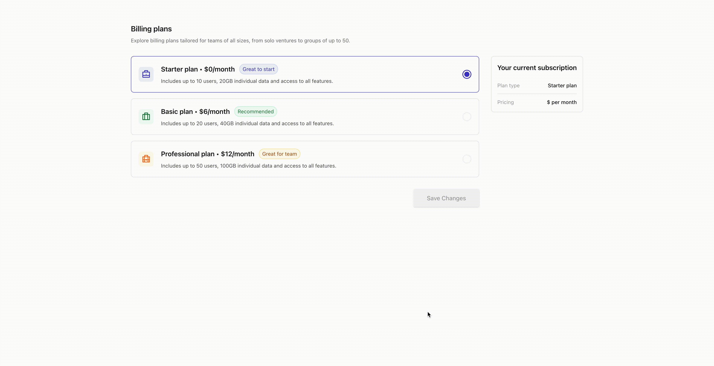

# Billing Plans Project

## Table of Contents

- [Introduction](#introduction)
- [Stack](#stack)
- [Features](#features)
- [Demo](#demo)

## Introduction

Welcome to the Billing Plans Project! This project allows users to select and manage their subscription plans with ease. It includes functionalities for upgrading, downgrading, and managing billing information.

## Stack

- **Next.js**
- **TypeScript**
- **Tailwind CSS**
- **PostgreSQL**

## Features

- Display different billing plans (Starter, Basic, Professional)
- Show current subscription details
- Allow users to change their subscription plan
- Trigger a modal to confirm changes before updating the plan
- Manage subscription state with context
- Format and display the next billing date
- Persist subscription state across page reloads
- Design optimized for visualization on mobile, tablet, and desktop devices

## Demo

Below are a few short demos of the key features of the Billing Plans Project in action:

